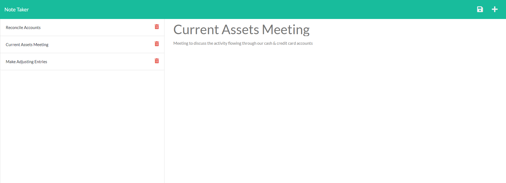

 # Note Taker
  
   

  ## Table-of-Contents

  * [Description](#description)
  * [Installation](#installation)
  * [Usage](#usage)
   
  * [Contributing](#contributing)
  * [Tests](#tests)
  * [Questions](#questions)
  
  ## [Description](#table-of-contents)

  Allows a small business owner to be able to write and save notes.

  To help a small business owners organize their thoughts and keep track of tasks they need to complete.

  The user will open the Note Taker and click the link to the notes page. They are presented with existing notes in the left-hand column, plus empty fields to enter a new note title and the note’s text in the right-hand column. They will enter a note title and the note's text. Then a save icon appears in the navigation at the top of the page. The user will click the save icon and the new note appears in the left-hand column with the other existing notes. When the user clicks on an existing note, that note appears in the right-hand column. When the user clicks the 'plus' sign on the top right of the page, the user is presented with empty fields to enter a new note. The user will also be able to delete any existing notes by clicking the trash can icon next to the name. 

  ## [Installation](#table-of-contents)

  No installation required.

  ## [Usage](#table-of-contents)

  To use, go to the following url:

  [Note Taker Deployed Website](https://shrouded-escarpment-97500.herokuapp.com/)
  
  Screenshot of Deployed Website
  
   

  ## [Contributing](#table-of-contents)
  
  
  Thank you for your interest in helping out; however, I will not be accepting contributions from third parties.
    

  ## [Tests](#table-of-contents)

  Go to the url in the usage section and type in a test note. Save the note when the save icon appears. Add another test note. Click on the first test note to see its contents reappear. Delete either note to make sure that functionality works. 

  ## [Questions](#table-of-contents)

  Please contact me using the following links:

  [GitHub](https://github.com/mjgiannelli)

  [Email: giannellimj@gmail.com](mailto:giannellimj@gmail.com)
